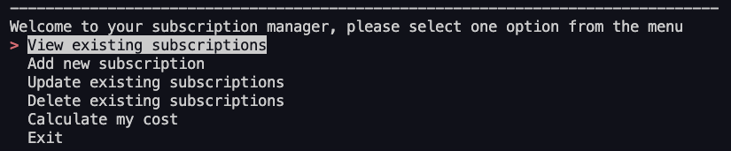

# JiLi_T1A3 Terminal App - Subscription Manager

## GitHub repo

[JiLi_T1A3 - Subscription Manager](https://github.com/JiLi94/Subscription-Manager.git)

## Presentation video


## Project description

This project aims to help users to create and manage their own subscription lists. The features include viewing the current subscription list, creating new subscriptions, updating/deleting existing subscriptions and calculating the cost based on their frequencies.

## How to install and run this project

This application will require the user have Python 3 installed on their computer. To run the application, ensure you are in the ```src``` directory, and input ```./run_application.sh``` in the terminal. The script will enable the virtual environment, install required packages and detect if Python 3 is installed. If Python 3 is installed, the program will start. The terminal will pop up a menu for the user to select different options.




The packages utilised in this project include:

- For showing menus in the terminal for user to select: [simple terminal menu package](https://pypi.org/project/simple-term-menu/)

- For manipulating JSON files: [json](https://docs.python.org/3/library/json.html)

- For conversion between strings and datetime: [datetime](https://docs.python.org/3/library/datetime.html)

- For getting keyboard input from the user: [getkey](https://pypi.org/project/getkey/)

- For testing: [pytest](https://docs.pytest.org/en/7.2.x/getting-started.html)

- For tools to deal with filepath and directories: [sys](https://docs.python.org/3/library/sys.html) & [os](https://docs.python.org/3/library/os.html)

## Features

### Terminal Menu

This application utilises a terminal menu package, and it allows to print options in the terminal and lets users to select between these options. This feature makes the app easier for users and can significantly reduce errors caused by human inputs. 

### View the current subscription list

This feature allows the user to view all existing subscriptions or subscriptions under a selected category. 

1. In the start-up terminal mean, select *View existing subscription* and press enter. 

2. The terminal will ask the user to select one category to view the subscriptions under this category. There will be one default option *View All* to check all existing subscriptions.

   

3. Select one category and press enter, the user will see all existing items under this category.

   

### Add new subscription

Users are able to add new subscriptions under an existing category or add a new category. 

1. Select *Add new subscription* in the main terminal menu.

2. The terminal will show any existing categories. Also, to make it easier for the user, the terminal menu will also show 4 default options for user to select, including *Entertainment*, *Productivity*, *Utility* and *Add New Category*.

   

3. To add new category, select *Add New Category*, then the user will be asked to enter a new category name. If the category name already exists, the newly-added subscription will be allocated under the existing category. To check if the category exists or not, the app will auto trim the spaces and is case insensitive. Also, the name cannot be null. 

4. After entering a new category name or selecting an existing category, the user will be asked to enter the name of the subscription. Similar to the category name, the name of the subscription cannot be null. Also, if the name already exists, the user will be asked to enter a different name. 

   

5. After entering a valid name, the user will be asked to select the frequency of the subscription. There are four options available: *daily*, *monthly*, *quarterly*, and *quarterly*.

   

6. After frequency, the user needs to input the charge of the subscription. The charge should only be a positive numeric value, otherwise, the user will be asked to input again until a valid number is received.

   

7. At last, the user needs to input the start date of the first bill. The date should be in the format of yyyy-mm-dd, otherwise, the user will be asked to input again.

   

8. The user will be informed the update has been successful after all inputs are done, and the new subscription will be printed out as well.

   

### Update existing subscription

This feature allows the user to update all attributes of an existing subscription, including *category*, *name*, *frequency*, *charge*, and *first bill date*.


1. Select *Update existing subscriptions* in the main terminal menu

2. Select one category from the existing categories

3. Select one existing subscription under the selected category

4. Select one attribute of the subscription to update. Each attribute will have the same properties and restriction as above. For example, the updated charge should be a positive number, and the first bill date should be in a valid date formate. 

   

5. After updating one attribute, the user will be asked to select other attributes to continue, or select *Done* to finish updating.

6. Same as above, the user will be informed the update has been successful, and the updated subscription will be printed out.

### Delete existing subscription

1. Select *Delete existing subscriptions* in the main terminal menu

2. Select one existing category

3. Select one existing subscription under the existing category

4. The user will be asked to confirm the deletion. The user needs to select from *Yes* or *No* to confirm. 

   

5. The deletion will be completed if the user selects *Yes*, and the terminal will print *Deleted Successfully* to confirm. If no subscription exists under a certain category after updating or deleting, the category will be deleted from the database as well.

### Calculate cost

With this feature, users can view their cost based on selected frequency.

1. Select *Calculate my cost* in the main terminal menu

2. Select one frequency from the list

3. The app will calculate the estimated cost and print in the terminal

   

## Testing

### JSON data validation

This test was designed to be an automation test. The idea is to test the whole structure of the JSON file and validate the data inside it. For example:

- The application was designed to not have duplicated categories or subscription names

- The 'frequency' of the subscriptions are not customizable and can only be one of ['Daily', 'Monthly', 'Quarterly', 'Annual']

- The 'charge' of the subscriptions should be floats

- The 'first bill date' of the subscriptions should be in the format of 'yyyy-mm-dd'

These test cases ensure the features such as add new or update existing subscriptions to write correct data into the database.

### Testing the feature of deleting existing subscriptions

This test was designed to test if the feature of deleting existing items works as expected. This test requires human input and due to time limit, it's not been automated. Manual test procedures are outlined below.

1. Select 'view existing subscriptions' to check the existing categories

    

2. Exit and select 'delete existing subscriptions', the terminal menu should be showing the same categories with step 1 (excluding 'View All')

    

3. If there is no existing subscription, the terminal menu should be showing 'You don't have any existing subscriptions'

4. Select into one category and select one subscription, the terminal menu should be confirming if the user really intends to delete the record
   
    

5. The delete confirmation only accepts 'Yes' or 'No' as the answer. If user input is not 'Yes' or 'No', the user will be asked again until correct answer is received
   
    

6. If the user inputs 'No', the application stops and nothing gets deleted. If user inputs 'Yes', the selected record will be deleted and users will be informed as 'deleted successfully'.

7. After deleting successfully, if the user selects to view the existing subscription again, the record should not exist. If no subscription exists under a certain category, the category should be deleted as well, so the user cannot view the category either.

## Implementation plan

## Limitations and future expectations

- the terminal menu can be more sophisticated, such as add preview window, allow multiple choice

- allow reverse actions

- can allow to add more contents to each subscription in the future, such as website url, etc. 

- This application only supports single user for now, but in the future hopefully it will be implemented more features so it can allow multiple users to create their own lists, and they can log in with their username and passwords.

## References

- - 

- style guide: [pep8](https://peps.python.org/pep-0008/)